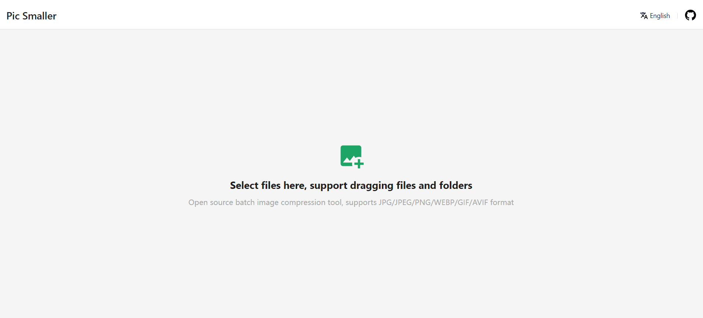

# Pic Smaller (图小小)

**Pic Smaller** is a super easy-to-use online image compression tool. Its UI is intuitive and supports compression configuration. At the same time, because it is purely local compression without any server-side logic, it is completely safe.

<br/>

<div></div>
<br/>
<div></div>
<br/>
<div></div>

<br/>

## Usage

Pic smaller has been deployed to [`vercel`](https://vercel.com/), you can use it by visiting the URL [pic-smaller.vercel.app](https://pic-smaller.vercel.app). Due to the GFW, Chinese users can use it by visiting the URL [picsmaller.com](https://picsmaller.com/)

> [picsmaller.com](https://picsmaller.com/) is a new domain that has just been applied for. The old domain [txx.cssrefs.com](https://txx.cssrefs.com/) is still accessible, but will be expired on `2025-02-22` and payment will not continue. Please use the latest domain to access the service.

## Develop

Pic smaller a [Vite](https://vitejs.dev/) + [React](https://react.dev/) project, you have to get familiar with them first. It uses modern browser technologies such as `OffscreenCanvas`, `WebAssembly`, and `Web Worker`. You should also be familiar with them before developing.

```bash
# Clone the repo
git clone https://github.com/joye61/pic-smaller.git

# Change cwd
cd ./pic-smaller

# Install dependences
npm install

# Start to develop
npm run dev
```

## Deploy

If you want to independently deploy this project on your own server, the following document based on Docker, and [Dockerfile](./Dockerfile) script has been tested. Within the project root directory, follow the instructions to start docker application

```bash
# Build docker image from Dockerfile
docker build -t picsmaller .

# Start a container
docker run -p 3001:3001 -d picsmaller
```

Now you can access the project via http://127.0.0.1:3001. If you want your project to be accessible to everyone, you need to prepare a domain name pointing to your local machine, and then proxy it to port 3001 of this machine, through a reverse proxy server like nginx.

## Thanks

- [ant-design](https://github.com/ant-design/ant-design) Provides React-based UI solutions
- [wasm-image-compressor](https://github.com/antelle/wasm-image-compressor) Provides PNG image compression implementation based on Webassembly
- [gifsicle-wasm-browser](https://github.com/renzhezhilu/gifsicle-wasm-browser) Provides GIF image compression implementation based on Webassembly
- [wasm_avif](https://github.com/packurl/wasm_avif) Provides AVIF image compression implementation based on Webassembly
- [svgo](https://github.com/svg/svgo) Provides SVG vector compression
