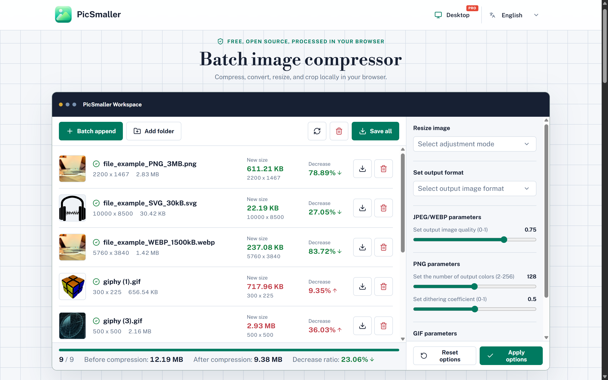

# Pic Smaller (图小小)

[English](README.md) · [简体中文](docs/readme/README.zh-CN.md) · [繁體中文](docs/readme/README.zh-TW.md) · [日本語](docs/readme/README.ja-JP.md) · [한국어](docs/readme/README.ko-KR.md) · [Français](docs/readme/README.fr-FR.md) · [Español](docs/readme/README.es-ES.md) · [فارسی](docs/readme/README.fa-IR.md) · [Türkçe](docs/readme/README.tr-TR.md)

> [!IMPORTANT]
> ### Pic Smaller Desktop — The Flagship Edition
> **Uncompromising native power, beyond the browser.**
>
> Elevate your workflow with the flagship Pic Smaller Desktop. A dedicated native application built for professionals who refuse to settle — it glides through massive files and entire folder libraries, supports 16+ image formats, and delivers superior processing performance. Complete the experience with an advanced suite of AI tools: background removal, watermark removal, and high-fidelity image upscaling.
>
> [](https://desktop.picsmaller.com/)

Pic Smaller is a free, open-source batch image compressor that runs entirely
in the browser. Images are processed locally with Web Workers, WebAssembly,
Canvas, and browser codecs. Files are never uploaded to an application server.

Use the hosted app at [picsmaller.com](https://picsmaller.com/) or
[www.picsmaller.com](https://www.picsmaller.com/).

## Features

- Compress JPEG, PNG, WebP, GIF, SVG, and AVIF images in batches.
- Decode HEIC and HEIF inputs locally and export them as JPEG, PNG, WebP, or AVIF.
- Convert formats, resize, crop, and control encoder-specific quality options.
- Add files by picker, folder picker, drag and drop, or clipboard paste.
- Compare original and compressed images with an interactive split view.
- Download individual results or save the complete batch as a ZIP archive.
- Keep images private: processing stays on the user's device.

## Screenshot



The core workspace combines batch input, compression results, output settings,
and download actions in one view.

## Development

Requirements:

- Node.js 22 LTS or newer
- npm 10 or newer

```bash
git clone https://github.com/joye61/pic-smaller.git
cd pic-smaller
npm ci
npm run dev
```

Useful commands:

```bash
npm test            # Run the test suite
npm run lint        # Run ESLint
npm run build       # Build the standalone Node.js server
npm run build:pages # Export the static Cloudflare Pages site to out/
```

## Deployment

### Cloudflare Pages

The public site uses Cloudflare Pages with the GitHub repository integration.
Cloudflare builds and deploys the site automatically with these settings:

| Setting | Value |
| --- | --- |
| Production branch | `master` |
| Preview branch | `develop` |
| Build command | `npm run build:pages` |
| Output directory | `out` |
| Node.js version | `22` |

Pushes to `master` update production. Pushes to `develop` create preview
deployments. Other branches do not deploy automatically.

The Pages build removes Next.js's generated top-level `404.html`, allowing
Cloudflare Pages to apply its native single-page application fallback.

### Docker

The Docker image is an alternative for private or self-hosted deployments. It
uses Next.js standalone output, runs as the unprivileged `node` user, handles
signals through `tini`, and includes a container health check.

```bash
docker build --pull -t pic-smaller:latest .

docker run -d \
  --name pic-smaller \
  --restart unless-stopped \
  --read-only \
  --tmpfs /tmp:rw,noexec,nosuid,size=64m \
  --cap-drop ALL \
  --security-opt no-new-privileges \
  -p 127.0.0.1:3000:3000 \
  pic-smaller:latest
```

Open `http://127.0.0.1:3000`. For public access, place the container behind a
TLS-terminating reverse proxy such as Caddy, nginx, or Traefik. Remove the
`127.0.0.1:` bind prefix only when direct network exposure is intentional.

### Secrets and configuration

The web application does not require API keys. Never commit credentials,
Cloudflare tokens, `.env` files, `.dev.vars`, private keys, or local Wrangler
state. The repository ignore rules exclude these files. If a future feature
needs secrets, store them in the deployment platform's secret manager and
provide only documented placeholder names in an `.env.example` file.

## Project Structure

- `src/app/`: Next.js application entry points.
- `src/components/`: reusable interface components.
- `src/engines/`: browser codecs, workers, transforms, and compression queue.
- `src/locales/`: translations.
- `src/views/`: application views.
- `public/`: browser codec and WebAssembly assets prepared during builds.
- `scripts/`: codec preparation and deployment build helpers.
- `tests/`: Node.js test suite.

## Contributing

1. Create a branch from `develop`.
2. Run `npm test`, `npm run lint`, and the relevant production build.
3. Update documentation and screenshots when behavior or the interface changes.
4. Open a focused pull request with a clear description and verification notes.

## License

Pic Smaller is available under the [MIT License](./LICENSE).

## Acknowledgements

- [Squoosh Kit](https://github.com/bnowak008/squoosh-kit) for AVIF, ImageQuant, and OxiPNG codecs.
- [heic-to](https://github.com/hoppergee/heic-to) for browser-side HEIC and HEIF decoding.
- [SVGO](https://github.com/svg/svgo) for SVG optimization.
- [gifsicle-wasm-browser](https://github.com/renzhezhilu/gifsicle-wasm-browser) for GIF compression.